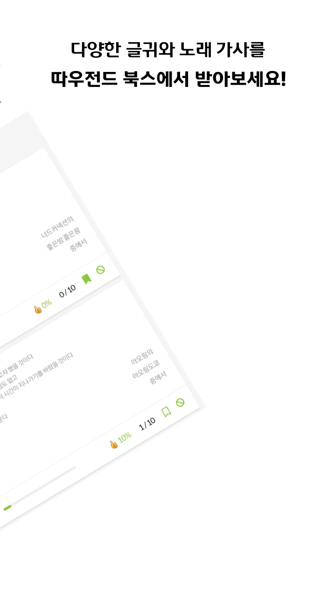

# 따북 Front ver 1.0

구글 앱스토어에서 서비스 했었던 따우전드 북스, 따북의 Front 소스코드 입니다.

Vue Framework로 개발되었습니다.

## 따북이란?
> 따우전드 북스 따북은 *'모티베이션'* 어플에서 착안한 웹앱입니다.

인스타그램이나 카카오톡 프로필 사진에 본인이 감명깊게 읽은 책 구절을 업로드 하는 사람들이 많아보여서

자신이 좋아하는 책 구절을 **다른 사람들과 공유**하고, 다른 사람이 올린 글을 내 **책갈피**에 꽂아두고, 꺼내보고

하루 3번 **푸시알림**으로 랜덤한 책 구절을 보내주는 기능을 구현했습니다.

단순한 CRUD의 비즈니스 로직이기에 대-단한 프로젝트라고 할 순 없지만

- 처음으로 홈 서버를 구축하고 배포 했다는 점
- 구글 Admob으로 광고를 삽입했다는 점
- 모바일 환경에서 구글 플레이 스토어를 통해 서비스 할 수 있었던 점

등등 많은 부분에서 애착이 가는 사이드 프로젝트 입니다.

아쉬운 점은 비용문제와 사진 업로드 서버 구축의 어려움 때문에

사진을 업로드하고 저장할 수 있는 클라우드 서비스나 s3 버켓을 활용하지 못한 점이 아쉽습니다.

이후 다른 사이드 프로젝트를 서비스 할 때는 사진까지 함께 공유할 수 있으면 좋겠습니다.

## 제작기간
- 22.10.20 ~ 22.11.14

## 개발인원
- 1인 사이드 프로젝트

## Front 개발환경

### Node.js
- ver 14.20.0
- yarn ver 1.22.0

### vue-cli
- ver 5.0.8

## 배포환경 및 CI/CD
- Docker / Jenkins
- Ubuntu 22.04
- Nginx 1.21.1 

## Setup -> Build

- ```yarn install``` 
- ```yarn serve``` 
- ```yarn build```

## 사용 버전

| 이름                               | 버전          | 사용                         |
| ---------------------------------- | ------------- | ---------------------------- |
| vue                                | 2.6.6         |                              |
| vue-router                         | 3.0.1         |                              |
| vuex                               | 3.0.1         |                              |
| vue-moment                         | 4.0.0         | Date                         |
| vue-kindergarten                   | 0.3.3         | 인증 / 인가                    |
| vue-i18n                           | 8.0.0         | 다국어 적용                  |
| vee-validate                       | 3.0.4         | Validation              |
| sweetalert2                        | 8.2.6         | Alert                        |
| axios                              | 0.18.0        | Rest API 통신                |
| @babel/polyfill                    | 7.4.4         | IE 적용하기                  |
| vue-plugin-load-script             | 1.2.0         |                              |

## 디렉토리 구조

```bash
├── assets
├── components
├── layout
│   ├── global
│   │   ├── index.js
│   │   ├── *.vue
├── kindergarten
│   ├── governesses
│   ├── perimeters
│   ├── childs.js
├── mixins
│   ├── global
│   │   ├── index.js
│   │   ├── *.js
│   ├── *.js
├── plugins
│   ├── material-kit
│   ├── index.js
│   ├── *.js
├── router
│   ├── index.js
│   ├── routes.js
├── store
│   ├── index.js
│   ├── modules
│   │   ├── index.js
│   │   ├── *.js
├── utils
│   ├── date.js
├── views
│   ├── *.vue
├── wrapper
│   ├── *.js
├── App.vue
├── main.js
```

## lint 규칙

- `standard` 적용
- ```yarn lint --fix```로 실행
